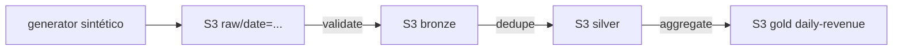

# Data-Lake-S3 (medallion: raw → bronze → silver → gold)

Lake em S3 com 4 camadas que transforma arquivos crus de transações em uma
tabela diária de receita por país, pronta para BI/ML. Local-first (MinIO,
custo zero) e o mesmo código roda na AWS real.

## 1. Problema
Arquivos de transações chegam crus, sem schema garantido, sem particionamento
e sem histórico confiável. Consumidores (BI, ML) precisam de dados validados,
deduplicados e agregados com reprocessamento seguro: rodar o mesmo dia duas
vezes nunca pode duplicar nem corromper nada.

## 2. Objetivo
Lake em S3 com 4 camadas, validação fail-fast, particionamento Hive
(`camada/date=YYYY-MM-DD/arquivo`) e idempotência por reescrita determinística
(overwrite, nunca append).

## 3. Arquitetura


| Camada | Objeto | Grão | O que garante |
|---|---|---|---|
| `raw` | `transactions-seed{seed}.csv` | evento (`transaction_id`) | Bruto imutável e reproduzível (mesmo seed → mesmos bytes) |
| `bronze` | `validated.csv` | evento | Schema, tipos, ranges e domínios válidos (falha o lote com todos os erros listados) |
| `silver` | `deduped.csv` | `transaction_id` único | Espelho da bronze; duplicatas barradas na validação (ver §17) |
| `gold` | `daily-revenue.csv` | `(day, country)` | Receita diária por país (semântica abaixo) |

## 4. Semântica do gold
`pipeline.VERSION = "2"`. Colunas:

| Coluna | Regra |
|---|---|
| `transactions` | total de eventos do grupo (approved + refunded) |
| `approved_transactions` | só `status = approved` |
| `revenue` | soma de `amount` **só de approved** |
| `refunds` | contagem de `status = refunded` |
| `refunded_amount` | soma de `amount` dos refunded |
| `net_revenue` | `revenue - refunded_amount` |

> Reembolsos **não** inflacionam a receita: antes da correção GOLD-01 o gold
> somava tudo como receita. A especificação está travada em teste literal
> (`tests/test_gold_revenue.py`).

## 5. Serviços AWS
S3 (objetos + metadata), IAM (policy `iam/s3-data-engineering.json`), CloudWatch Logs
para logs da pipeline. Local: MinIO S3-compatível (console em `http://127.0.0.1:9001`).

## 6. Fluxo de dados
`seed_raw` (CSV determinístico por seed) → `raw_to_bronze` (schema/tipos/ranges,
rejeita tudo de uma vez, inclusive duplicatas) → `bronze_to_silver`
(pass-through determinístico; sem dedupe morto) →
`silver_to_gold` (agregação da seção 4).

## 7. Estrutura
```
src/lake/       generator.py lake.py validate.py pipeline.py run.py
src/de_common/  config.py aws.py errors.py ids.py logging.py   # compartilhada (vendored)
tests/          test_generator_validate.py  # determinismo + 4 classes de erro
                test_gold_revenue.py        # regra de receita (literal) + e2e em moto
                test_silver_contract.py   # duplicata reprova o lote; silver = espelho da bronze
                test_lake_moto.py           # ciclo de vida S3
                test_de_common_*.py         # config, ids, logging
                test_pipeline_e2e.py        # MinIO: reconciliação + rerun idêntico
scripts/run_local.sh   # demo end-to-end (sobe o MinIO sozinho)
iam/s3-data-engineering.json
docs/revisao-engenharia-dados.md   # revisão técnica completa + roadmap
```

## 8. Pré-requisitos
Python 3.12+, AWS CLI, podman (para o MinIO via `run_local.sh`).

## 9. Configuração
Copie `.env.example` para `.env` (nunca commite o `.env`; os defaults já
apontam para o MinIO local). `Settings.from_env()` — sem credenciais no código.

| Variável | Local | AWS real |
|---|---|---|
| `AWS_ENDPOINT_URL` | `http://127.0.0.1:9000` | *(remover)* |
| `AWS_ACCESS_KEY_ID` / `AWS_SECRET_ACCESS_KEY` | `minioadmin` / `minioadmin` | *(remover; vale o profile SSO)* |
| `AWS_PROFILE` | `local` | profile SSO |
| `AWS_REGION` | `sa-east-1` | `sa-east-1` |
| `LAKE_BUCKET` | `data-engineer-lab-local` | `data-engineer-lab-<account-id>` |
| `ENV_NAME` | `local` | `prod` |

## 10. IAM necessário
`s3:ListAllMyBuckets` + `List/Get/Put/DeleteObject` só em
`arn:aws:s3:::data-engineer-lab-*` (ver `iam/s3-data-engineering.json`).

## 11. Execução local
```bash
cd Data-Lake-S3
python3 -m venv .venv && .venv/bin/pip install -r requirements.txt
./scripts/run_local.sh [YYYY-MM-DD] [N]   # defaults: 2026-10-08, 2000 transações, seed 42
.venv/bin/python -m pytest -v
```
O script sobe o MinIO via podman se preciso, faz seed + promoção
raw→bronze→silver→gold e imprime os logs JSON de cada estágio. Rerun do mesmo
dia gera objetos idênticos (idempotência verificada em teste). Navegue nos
arquivos pelo console em `http://127.0.0.1:9001` (`minioadmin`/`minioadmin`).

Ou passo a passo:
```bash
export AWS_ENDPOINT_URL=http://127.0.0.1:9000 AWS_PROFILE=local LAKE_BUCKET=data-engineer-lab-local
export AWS_ACCESS_KEY_ID=minioadmin AWS_SECRET_ACCESS_KEY=minioadmin
.venv/bin/python -m lake.run --date 2026-10-08 --transactions 2000 --seed 42
```

## 12. Deploy AWS
Remover `AWS_ENDPOINT_URL`, usar profile SSO; bucket real
`data-engineer-lab-<account-id>`; mesmas keys funcionam sem alteração.

## 13. Testes
```bash
.venv/bin/python -m pytest -v
```
- `test_generator_validate.py` — determinismo do gerador, roundtrip CSV, 4 classes de erro rejeitadas.
- `test_gold_revenue.py` — **especificação da receita** com valores fixos (2 approved + 1 refunded → `revenue=150.00`, `net=120.00`) + e2e completo em moto. **Roda no CI.**
- `test_silver_contract.py` — duplicata (mesmo entre 2 arquivos raw) reprova o lote; silver é byte-idêntica à bronze. **Roda no CI.**
- `test_lake_moto.py` — ciclo de vida S3 (upload/exists/list/get/copy) e `ensure_bucket` idempotente.
- `test_pipeline_e2e.py` — contra MinIO: reconciliação do gold + rerun idêntico. Roda no CI (MinIO como service) e localmente com a stack no ar; pulado só sem S3 compatível.
- `ruff check .`, `ruff format --check .`, `mypy src` (strict) e scan gitleaks rodam no CI.

## 14. Observabilidade
Logs JSON (`ts/level/logger/msg` + campos) em cada estágio com row counts:
```json
{"ts": "2026-10-08T12:00:00+00:00", "level": "INFO", "logger": "lake.pipeline", "msg": "gold written", "dest": "gold/date=2026-10-08/daily-revenue.csv", "rows": 5}
```
Metadata no objeto (`rows`, `sources`, `pipeline-version`) = auditoria sem catálogo.

## 15. Custos
Local: zero. AWS: S3 barato (GB + requests); lifecycle para IA/Glacier no raw
antigo (a codificar); `delete_prefix` manual antes de remover o bucket.

## 16. Limitações conhecidas
Sem orquestrador (CLI + `--date`; Step Functions no projeto 11), sem retry nas
chamadas S3, sem `_SUCCESS`/manifesto de frescor, sem quarentena (1 linha ruim
derruba o dia), dinheiro somado em float, `ts` sem timezone, gold em CSV
(parquet no 03), sem streaming (05). Diagnóstico completo com severidade e
esforço em `docs/revisao-engenharia-dados.md`.

## 17. Decisões
- Reescrita determinística em vez de checkpoint: rerun é sempre seguro.
- Validação coleta TODOS os erros antes de falhar (debug em 1 ciclo).
- Metadata no objeto (`rows`, `sources`) = auditoria sem catálogo.
- `revenue` soma só `approved`; reembolso vai para `refunded_amount` e abate em `net_revenue` (GOLD-01).
- Duplicata reprova o lote na bronze; a silver é pass-through sem `drop_duplicates` morto (SILVER-01, opção fail-fast documentado).
- Teste literal como especificação: o e2e que recomputa o esperado com a mesma lógica não prova a regra (E2E-01).

## 18. Melhorias (próximas, por prioridade)
Quarentena de linhas inválidas (SILVER-01), retry S3, `_SUCCESS` + manifesto por
data, `ts` com timezone, lifecycle como código. Depois: bronze por hora,
`silver/` em parquet, S3 Inventory, Glue Catalog.
