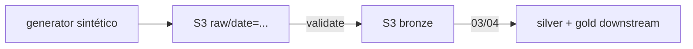

# Data-Lake-S3 (landing zone: raw → bronze)

Landing zone em S3: arquivos crus de transações viram bronze validada, pronta
para curadoria downstream. Local-first (MinIO, custo zero) e o mesmo código
roda na AWS real. Silver/gold moram nos projetos 03/04 — aqui há exatamente
um dono por camada.

## 1. Problema
Arquivos de transações chegam crus, sem schema garantido, sem particionamento
e sem histórico confiável. O downstream (curadoria silver/gold nos projetos
03/04, BI, ML) precisa de uma bronze validada com reprocessamento seguro:
rodar o mesmo dia duas vezes nunca pode duplicar nem corromper nada.

## 2. Objetivo
Landing zone em S3 com 2 camadas, validação fail-fast, particionamento Hive
(`camada/date=YYYY-MM-DD/arquivo`) e idempotência por reescrita determinística
(overwrite, nunca append).

## 3. Arquitetura


| Camada | Objeto | Grão | O que garante | Dono |
|---|---|---|---|---|
| `raw` | `transactions-seed{seed}.csv` | evento (`transaction_id`) | Bruto imutável e reproduzível (mesmo seed → mesmos bytes) | este projeto |
| `bronze` | `validated.csv` | evento | Schema, tipos, ranges e domínios válidos (falha o lote com todos os erros listados; duplicata reprova) | este projeto |
| `silver`/`gold` | — | — | Curadoria e agregados de negócio | projetos 03/04 |

## 4. Fronteira (o que NÃO está aqui)
Silver/gold saíram deste projeto de propósito: um dono por camada. A última
regra de gold conocida era `revenue` só de `approved`, `refunded_amount`
separado, `net_revenue = revenue - refunded_amount` (GOLD-01) — os projetos
03/04 partem dela quando implementarem a curadoria.

## 5. Serviços AWS
S3 (objetos + metadata), IAM (policy `iam/s3-data-engineering.json`), CloudWatch Logs
para logs da pipeline. Local: MinIO S3-compatível (console em `http://127.0.0.1:9001`).

## 6. Fluxo de dados
`seed_raw` (CSV determinístico por seed) → `raw_to_bronze` (schema/tipos/ranges,
rejeita tudo de uma vez, inclusive duplicatas). Fim: a bronze é o contrato
de saída para 03/04.

## 7. Estrutura
```
src/lake/       generator.py lake.py validate.py pipeline.py run.py
src/de_common/  config.py aws.py errors.py ids.py logging.py   # compartilhada (vendored)
tests/          test_generator_validate.py  # determinismo + 4 classes de erro
                test_lake_moto.py           # ciclo de vida S3
                test_de_common_*.py         # config, ids, logging
                test_pipeline_e2e.py        # MinIO: bronze valida + rerun idêntico
scripts/run_local.sh   # demo end-to-end (sobe o MinIO sozinho)
iam/s3-data-engineering.json
docs/revisao-engenharia-dados.md   # revisão técnica completa + roadmap
```

## 8. Pré-requisitos
Python 3.12+, AWS CLI, podman (para o MinIO via `run_local.sh`).

## 9. Configuração
Copie `.env.example` para `.env` (nunca commite o `.env`; os defaults já
apontam para o MinIO local). `Settings.from_env()` — sem credenciais no código.

| Variável | Local | AWS real |
|---|---|---|
| `AWS_ENDPOINT_URL` | `http://127.0.0.1:9000` | *(remover)* |
| `AWS_ACCESS_KEY_ID` / `AWS_SECRET_ACCESS_KEY` | `minioadmin` / `minioadmin` | *(remover; vale o profile SSO)* |
| `AWS_PROFILE` | `local` | profile SSO |
| `AWS_REGION` | `sa-east-1` | `sa-east-1` |
| `LAKE_BUCKET` | `data-engineer-lab-local` | `data-engineer-lab-<account-id>` |
| `ENV_NAME` | `local` | `prod` |

## 10. IAM necessário
`s3:ListAllMyBuckets` + `List/Get/Put/DeleteObject` só em
`arn:aws:s3:::data-engineer-lab-*` (ver `iam/s3-data-engineering.json`).

## 11. Execução local
```bash
cd Data-Lake-S3
python3 -m venv .venv && .venv/bin/pip install -r requirements.txt
./scripts/run_local.sh [YYYY-MM-DD] [N]   # defaults: 2026-10-08, 2000 transações, seed 42
.venv/bin/python -m pytest -v
```
O script sobe o MinIO via podman se preciso, faz seed + promoção
raw→bronze e imprime os logs JSON de cada estágio. Rerun do mesmo
dia gera objetos idênticos (idempotência verificada em teste). Navegue nos
arquivos pelo console em `http://127.0.0.1:9001` (`minioadmin`/`minioadmin`).

Ou passo a passo:
```bash
export AWS_ENDPOINT_URL=http://127.0.0.1:9000 AWS_PROFILE=local LAKE_BUCKET=data-engineer-lab-local
export AWS_ACCESS_KEY_ID=minioadmin AWS_SECRET_ACCESS_KEY=minioadmin
.venv/bin/python -m lake.run --date 2026-10-08 --transactions 2000 --seed 42
```

## 12. Deploy AWS
Remover `AWS_ENDPOINT_URL`, usar profile SSO; bucket real
`data-engineer-lab-<account-id>`; mesmas keys funcionam sem alteração.

## 13. Testes
```bash
.venv/bin/python -m pytest -v
```
- `test_generator_validate.py` — determinismo do gerador, roundtrip CSV, 4 classes de erro rejeitadas.
- `test_lake_moto.py` — ciclo de vida S3 (upload/exists/list/get/copy) e `ensure_bucket` idempotente.
- `test_pipeline_e2e.py` — contra MinIO: bronze com 500 linhas válidas e `transaction_id` único + rerun byte-idêntico. Roda no CI (MinIO como service) e localmente com a stack no ar; pulado só sem S3 compatível.
- `ruff check .`, `ruff format --check .`, `mypy src` (strict) e scan gitleaks rodam no CI.

## 14. Observabilidade
Logs JSON (`ts/level/logger/msg` + campos) em cada estágio com row counts:
```json
{"ts": "2026-10-08T12:00:00+00:00", "level": "INFO", "logger": "lake.pipeline", "msg": "bronze written", "dest": "bronze/date=2026-10-08/validated.csv", "rows": 2000}
```
Metadata no objeto (`rows`, `sources`, `status`) = auditoria sem catálogo.

## 15. Custos
Local: zero. AWS: S3 barato (GB + requests); lifecycle para IA/Glacier no raw
antigo (a codificar); `delete_prefix` manual antes de remover o bucket.

## 16. Limitações conhecidas
Sem orquestrador (CLI + `--date`; Step Functions no projeto 11), sem retry nas
chamadas S3, sem `_SUCCESS`/manifesto de frescor, sem quarentena (1 linha ruim
derruba o dia), `ts` sem timezone. Silver/gold vivem nos projetos 03/04.
Diagnóstico completo com severidade e esforço em `docs/revisao-engenharia-dados.md`.

## 17. Decisões
- Landing zone, não lakehouse: este projeto para na bronze; silver/gold têm dono downstream (03/04). Um dono por camada.
- Reescrita determinística em vez de checkpoint: rerun é sempre seguro.
- Validação coleta TODOS os erros antes de falhar (debug em 1 ciclo); duplicata reprova o lote.
- Metadata no objeto (`rows`, `sources`) = auditoria sem catálogo.
- Teste e2e como trava de idempotência: rerun gera bytes idênticos.

## 18. Melhorias (próximas, por prioridade)
Retry S3, `_SUCCESS` + manifesto por data, `ts` com timezone, quarentena de
linhas inválidas, lifecycle como código. Depois: bronze por hora, S3 Inventory.
